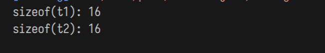
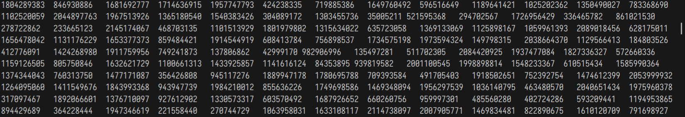

# 西邮Linux兴趣小组2021纳新面试题

感谢 [Zhilu](https://github.com/L33Z22L11) 重新录入题目原件。好人一生平安。

注:
- 本题目仅作`西邮Linux兴趣小组`2021纳新面试题的有限参考。
- 为节省版面本试题的程序源码中省略了`#include`指令。
- 本试题中的程序源码仅用于考察C语言基础，不应当作为C语言代码风格的范例。
- 题目难度与序号无关。
- 所有题目均假设编译并运行`x86_64 GNU/Linux`环境。

Copyright © 2021 西邮Linux兴趣小组, All Rights Reserved.
本试题使用采用 [知识共享署名-非商业性使用-相同方式共享 4.0 国际许可协议](http://creativecommons.org/licenses/by-nc-sa/4.0/) 进行许可。

## 1. 大小和长度竟然不是一个意思

`sizeof()`和`strlen()`有什么异同之处？

他们对于不同参数的结果有什么不同？请试举例子说明。

```c
int main(void) {
    char s[] = "I love Linux\0\0\0";
    int a = sizeof(s);
    int b = strlen(s);
    printf("%d %d\n", a, b);
}
```
   > `sizeof()`为**关键字**而非函数！！！ 
   
   > `sizeof()`会在**编译**时确定其值，故其中所有语句均不会被执行

   > 初始化字符串时，会自动为末尾加上`\0`

   `sizeof(s)` `s`为字符串`"I love Linux\0\0\0"`，其中每个字母占一个字节，空格占一个字节，`\0`占一个字节，所以`a`的值应该为16

   `strlen(s)`是一个函数，它的返回值为s的实际长度，遇到`\0`结束，所以输出为12

   ***

   ## 2. 箱子的大小和装入物品的顺序有关

`test1`和`test2`都含有：1个`short`、1个`int`、1个`double`，那么`sizeof(t1)`和`sizeof(t2)`是否相等呢？这是为什么呢？

```c
struct test1 {
    int a;
    short b;
    double c;
};
struct test2 {
    short b;
    int a;
    double c;
};
int main(void) {
    struct test1 t1;
    struct test2 t2;
    printf("sizeof(t1): %d\n", sizeof(t1));
    printf("sizeof(t2): %d\n", sizeof(t2));
}
```
> 内存对齐！！！！
> 
> 在结构体中，每个成员所占的内存会自动按照2 4 6 8 ...字节对齐，详情见：https://zhuanlan.zhihu.com/p/30007037

  `test1`中：
  ```c
  struct test1 {
    int a;//4字节
    short b;//2字节
    double c;//8字节
};//共14字节（X）应该为16字节
  ``` 
  `test2`中:
  ```c
struct test2 {
    short b;//2
    int a;//4
    double c;//8
};//16
  ```
  所以`sizeof(t1)`与`sizeof(t2)`相等，且该题输出为16 16
  
***
## 3. 哦，又是函数
想必在高数老师的教导下大家十分熟悉函数这个概念。那么你了解计算机程序设计中的函数吗？请编写一个`func`函数，用来输出二维数组`arr`中每个元素的值。

```c
/*在这里补全func函数的定义*/
int main(void) {
    int arr[10][13];
    for (int i = 0; i < 10; i++) {
        for (int j = 0; j < 13; j++) {
            arr[i][j] = rand();
        }
    }
    func(arr);
}
```

根据题设来看，要求将`arr`中的所有数据输出，这里用两个循环嵌套的方式实现
```c
void func(int (*arr)[13])
{
    for(int i=0;i<10;i++)//用i代表行
    {
        for(int j=0;j<13;j++)//用j代表列;
        {
            printf("%d\t",arr[i][j]);
        }//逐个输出本行元素
        printf("\n");//输出完当前行后换行
    }
}
```
输出：


***
## 4.就不能换个变量名吗？

- 请结合下面的程序，简要谈谈`传值`和`传址`的区别。
- 简要谈谈你对C语言中变量的生命周期的认识。

```c
int ver = 123;
void func1(int ver) {
    ver++;
    printf("ver = %d\n", ver);
}
void func2(int *pr) {
    *pr = 1234;
    printf("*pr = %d\n", *pr);
    pr = 5678;
    printf("ver = %d\n", ver);
}
int main() {
    int a = 0;
    int ver = 1025;
    for (int a = 3; a < 4; a++) {
        static int a = 5;
        printf("a = %d\n", a);
        a = ver;
        func1(ver);
        int ver = 7;
        printf("ver = %d\n", ver);
        func2(&ver);
    }
    printf("a = %d\tver = %d\n", a, ver);
}
```
