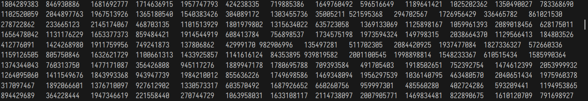

# 西邮Linux兴趣小组2021纳新面试题

>感谢 [Zhilu](https://github.com/L33Z22L11) 重新录入题目原件。好人一生平安。

>注:
>- 本题目仅作`西邮Linux兴趣小组`2021纳新面试题的有限参考。
>- 为节省版面本试题的程序源码中省略了`#include`指令。
>- 本试题中的程序源码仅用于考察C语言基础，不应当作为C语言代码风格的范例。
>- 题目难度与序号无关。
>- 所有题目均假设编译并运行`x86_64 GNU/Linux`环境。

>Copyright © 2021 西邮Linux兴趣小组, All Rights Reserved.
>本试题使用采用 [知识共享署名-非商业性使用-相同方式共享 4.0 国际许可协议]>(http://creativecommons.org/licenses/by-nc-sa/4.0/) 进行许可。

## 1. 大小和长度竟然不是一个意思

>`sizeof()`和`strlen()`有什么异同之处？

>他们对于不同参数的结果有什么不同？请试举例子说明。

```c
int main(void) {
    char s[] = "I love Linux\0\0\0";
    int a = sizeof(s);
    int b = strlen(s);
    printf("%d %d\n", a, b);
}
```
   > `sizeof()`为**关键字**而非函数！！！ 
   
   > `sizeof()`会在**编译**时确定其值，故其中所有语句均不会被执行

   > 初始化字符串时，会自动为末尾加上`\0`

   `sizeof(s)` `s`为字符串`"I love Linux\0\0\0"`，其中每个字母占一个字节，空格占一个字节，`\0`占一个字节，所以`a`的值应该为16

   `strlen(s)`是一个函数，它的返回值为s的实际长度，遇到`\0`结束，所以输出为12

   ***

   ## 2. 箱子的大小和装入物品的顺序有关

>`test1`和`test2`都含有：1个`short`、1个`int`、1个`double`，那么`sizeof(t1)`和`sizeof(t2)`是否相等呢？这是为什么呢？

```c
struct test1 {
    int a;
    short b;
    double c;
};
struct test2 {
    short b;
    int a;
    double c;
};
int main(void) {
    struct test1 t1;
    struct test2 t2;
    printf("sizeof(t1): %d\n", sizeof(t1));
    printf("sizeof(t2): %d\n", sizeof(t2));
}
```
> 内存对齐！！！！
> 
> 在结构体中，每个成员所占的内存会自动按照2 4 6 8 ...字节对齐，详情见：https://zhuanlan.zhihu.com/p/30007037

  `test1`中：
  ```c
  struct test1 {
    int a;//4字节
    short b;//2字节
    double c;//8字节
};//共14字节（X）应该为16字节
  ``` 
  `test2`中:
  ```c
struct test2 {
    short b;//2
    int a;//4
    double c;//8
};//16
  ```
  所以`sizeof(t1)`与`sizeof(t2)`相等，且该题输出为16 16
  
***
## 3. 哦，又是函数
>想必在高数老师的教导下大家十分熟悉函数这个概念。那么你了解计算机程序设计中的函数吗？请编写一个`func`函数，用来输出二维数组`arr`中每个元素的值。

```c
/*在这里补全func函数的定义*/
int main(void) {
    int arr[10][13];
    for (int i = 0; i < 10; i++) {
        for (int j = 0; j < 13; j++) {
            arr[i][j] = rand();
        }
    }
    func(arr);
}
```

根据题设来看，要求将`arr`中的所有数据输出，这里用两个循环嵌套的方式实现
```c
void func(int (*arr)[13])
{
    for(int i=0;i<10;i++)//用i代表行
    {
        for(int j=0;j<13;j++)//用j代表列;
        {
            printf("%d\t",arr[i][j]);
        }//逐个输出本行元素
        printf("\n");//输出完当前行后换行
    }
}
```
输出：


***
## 4.就不能换个变量名吗？

>- 请结合下面的程序，简要谈谈`传值`和`传址`的区别。
>- 简要谈谈你对C语言中变量的生命周期的认识。

```c
int ver = 123;
void func1(int ver) {
    ver++;
    printf("ver = %d\n", ver);
}
void func2(int *pr) {
    *pr = 1234;
    printf("*pr = %d\n", *pr);
    pr = 5678;
    printf("ver = %d\n", ver);
}
int main() {
    int a = 0;
    int ver = 1025;
    for (int a = 3; a < 4; a++) {
        static int a = 5;
        printf("a = %d\n", a);
        a = ver;
        func1(ver);
        int ver = 7;
        printf("ver = %d\n", ver);
        func2(&ver);
    }
    printf("a = %d\tver = %d\n", a, ver);
}
```
`传值`：将实参的值赋给行参，不影响实参的值
`传址`：将实参的地址赋给行参，这时实参和行参指向同一个地址，会改变实参的值

`生命周期`：一个变量从声明开始，直到删除改变量，这之间就是它的生命周期。

> `作用域与生命周期`:
> `a.普通局部变量`
属于某个{}，在{}外部不能使用此变量，在{}内部是可以使用。执行到普通局部变量定义语句，才会分配空间，离开{}，自动释放。普通局部变量不初始化，默认值为随机数。
`b.static局部变量`
属于某个{}，在{}外部不能使用此变量，在{}内部是可以使用。在编译阶段就已经分配空间，初始化只能使用常量。static局部变量不初始化，默认值为0。离开{}，static局部变量不会释放，只有整个程序结束才释放。
注意：静态局部变量的作用域属于某个{},但是它的生命周期却是从编译阶段到整个程序结束。
`c.普通全局变量`
在编译阶段分配空间，只有整个程序结束才释放。普通全局变量只要定义了，任何地方都能使用，使用前需要声明所有的.c文件，只能定义一次普通全局变量，但是可以声明多次（外部链接）。
注意：全局变量的作用域是全局范围，但是在某个文件中使用时，必须先声明。
`d.static全局变量`
在编译阶段分配空间，只有整个程序结束才释放。static全局变量只能在定义所在的文件中使用此变量（内部链接）。不同的.c文件，可以定义一次static全局变量。
`e.extern函数和static函数的区别（作用域）`
extern函数所有文件都是调用，所有文件中只能定义一次extern函数。
static函数只能在定义所在的文件中调用此函数，不同文件，可以定义一次static函数。
————————————————
版权声明：本文为CSDN博主「-天凉好秋-」的原创文章，遵循CC 4.0 BY-SA版权协议，转载请附上原文出处链接及本声明。
原文链接：https://blog.csdn.net/u011616739/article/details/62052179
***
## 5. 套娃真好玩！

>请说明下面的程序是如何完成求和的？

```c
unsigned sum(unsigned n) { return n ? sum(n - 1) + n : 0; }
int main(void) { printf("%u\n", sum(100)); }
```
该题运用了*递归*的知识:


根据代码，可以看出当`n`不为0时，会再次调用`sum`函数直到`n`减为0；所以当n为100时，该函数共调用101次，最终返回为0-100的累加。

***
## 6. 算不对的算术

```c
void func(void) {
    short a = -2;
    unsigned int b = 1;
    b += a;//b=-1=>因为b为无符号整型，所以b会变为一个非常大的数（2^32-1）
    int c = -1;
    unsigned short d = c * 256;//d=-256=>65280
    c <<= 4;//c左移4位得到c=-16
    int e = 2;
    e = ~e | 6;//e取反后与6按位或得到-1
    d = (d & 0xff) + 0x2022;//d=8226
    printf("a=0x%hx\tb=0x%x\td=0x%hx\te=0x%x\n", a, b, d, e);//以16进制输出a、b、d、e
    printf("c=Ox%hhx\t\n", (signed char)c);//将c强制转化为sined char类型，再以16进制输出
}
```

    - short         //2字节
    - unsigned int  //4字节
    - int           //4字节
    - unsigned short//2字节

    输出格式：%[输入数据宽度][长度]类型
    其中`h`表示按短整形量输出，`l`表示按短整形量输出
    
***
## 7. 指针和数组的恩怨情仇

```c
int main(void) {
    int a[3][3] = {{1, 2, 3}, {4, 5, 6}, {7, 8, 9}};
    int(*b)[3] = a;//b指向a第一行的元素
    ++b;//指向第二行元素
    b[1][1] = 10;//b[1][1]为它指向的行的下一行第二个元素，所以8被改为10
    int *ptr = (int *)(&a + 1);//&a+1使指其跳到a[3][0]的位置，所以ptr指向一个空的地址
    printf("%d %d %d \n", a[2][1], **(a + 1), *(ptr - 1));//a[2][1]被更改为10；(a+1)指向a第二行，*(a+1)指向其第二行的首元素的地址；ptr-1指向a最后一个元素的地址；
    }
```

***
## 8. 移形换位之术

>下面有`a`、`b`、`c`三个变量和4个相似的函数。
>- 你能说出使用这三个变量的值或地址作为参数分别调用这5个函数，在语法上是否正确吗？
>- 请找出下面的代码中的错误。
>- `const int`和`int const`是否有区别？如果有区别，请谈谈他们的区别。
>- `const int *`和`int const *`是否有区别？如果有区别，请谈谈他们的区别。

```c
int a = 1;
int const b = 2;
const int c = 3;
void funco(int n) {
    n += 1;
    n = a;
}
void func1(int *n) {
    *n += 1;
    n = &a;
}
void func2(const int *n) {
    *n += 1;
    n = &a;
}
void func3(int *const n) {
    *n += 1;
    n = &a;
}
void func4(const int *const n) {
    *n += 1;
    n = &a;
}
```
   `func2` `func3` `func3`错误
>`const int`和`int const`一样，表示改变量的值不能直接通过变量名来改
>
>`const int *`和`int const *`一样，表示该指针指向的值不能被修改
***
## 9. 听说翻转字母大小写不影响英文的阅读？

>请编写`convert`函数用来将作为参数的字符串中的大写字母转换为小写字母，将小写字母转换为大写字母。返回转换完成得到的新字符串。

```c
char *convert(const char *s);
int main(void) {
    char *str = "XiyouLinux Group 2022";
    char *temp = convert(str);
    puts(temp);
}
```
```c
char *convert(const char *s){
    char *p=(char*)calloc(50,sizeof(char));
   for(int i=0;i<strlen(s);i++){
    if(s[i]<='z'&&s[i]>='a') p[i]=s[i]-32;
    else if(s[i]<='Z'&&s[i]>='A') p[i]=s[i]+32;
    else p[i]=s[i];
   }
   p[strlen(s)]='\0';
   return p;
}
```
> 这里开辟了一个新字符串用来存替换后的字符

***
## 10. 交换礼物的方式

>- 请判断下面的三种`Swap`的正误，分别分析他们的优缺点。
>- 你知道这里的`do {...} while(0)`的作用吗？
>- 你还有其他的方式实现`Swap`功能吗？

```c
#define Swap1(a, b, t)   \
    do {                 \
        t = a;           \
        a = b;           \
        b = t;           \
    } while (0)
#define Swap2(a, b)      \
    do {                 \
        int t = a;       \
        a = b;           \
        b = t;           \
    } while (0)
void Swap3(int a, int b) {
    int t = a;
    a = b;
    b = t;
}
```
- Swap1正确，但在应用时要声明一个中间变量t
- Swap2正确，声明了一个局部变量t，在交换完ab值后删除
- Swap3错误，这个函数只传入了a，b的值，并没有将地址传入，所以只在函数内交换了a，b的值

`do {...} while(0)`只让ab交换一次值，且在`Swap2`中使`t`成为了局部变量

其他方式:
```c
void Swap4(int *p,int *q)
{
    
    *p=*p+*q;
    *q=*p-*q;
    *p=*p-*q;
}
```
>此外，还有运用位运算、直接交换内存等方式

***
## 11. 据说有个东西叫参数

>你知道`argc`和`argv`的含义吗？请解释下面的程序。你能在不使用`argc`的前提下，完成对`argv`的遍历吗？

```c
int main(int argc, char *argv[]) {
    printf("argc = %d\n", argc);
    for (int i = 0; i < argc; i++)
        printf("%s\n", argv[i]);
}
```
`argc`用来统计命令行传给`main`函数参数的个数
`argv`将传给`main`函数的参数以字符串的格式存起来,其中
- `argv[0]`指向程序的全路径名
- `argv[argc]`指向NULL

```c
int main(int argc, char *argv[]) {
    printf("argc = %d\n", argc);
    for (int i = 0;argv[i]!=NULL; i++)
        printf("%s\n", argv[i]);
}

```
***
## 12. 人去楼空

>这段代码有是否存在错误？谈一谈静态变量与其他变量的异同。

```c
int *func1(void) {
    static int n = 0;
    n = 1;
    return &n;//因为n是静态变量，所以n的地址一直存在
}
int *func2(void) {
    int *p = (int *)malloc(sizeof(int));
    *p = 3;
    return p;//返回p的首元素地址
}//*func3错误
int *func3(void) {
    int n = 4;
    return &n;//n在函数结束时被删除了，相当于返回一个野指针
}
int main(void) {
    *func1() = 4;
    *func2() = 5;
    *func3() = 6;
}
```
***
## 13. 奇怪的输出

```c
int main(void) {
    int data[] = {0x636c6557, 0x20656d6f, 0x78206f74,
                  0x756f7969, 0x6e694c20, 0x67207875,
                  0x70756f72, 0x32303220, 0x00000a31};
    puts((const char*)data);//将data强制转换成字符串形式并输出
}
```

***

## 14. 请谈谈对从「C语言文件到可执行文件」的过程的理解
预处理->编译->汇编->链接
### 1.预处理
- 解析所有的条件预处理指令
- 解析宏，并替换代码中的宏
- 删除注释
- 解析#include并将引出的头文件拷贝到#include位置
- 添加行号和文件标识
- 保留#program，留给编译过程
**以.c文件生成.i文件**
### 2.编译
**以.i文件生成.s文件（以汇编语言完成）**
- 词法分析
- 语法分析
- 语义分析
- 源代码优化
- 目标代码生成
- 目标代码优化
### 3.汇编
将汇编语句转化为机器码**以.s文件生成.o的二进制文件**

### 4.链接
连接器将所有二进制的目标文件和系统组件组合成一个可执行文件(.exe)
