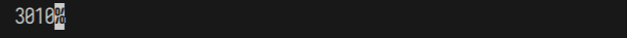
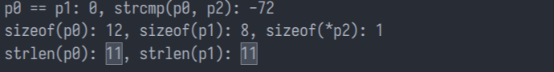
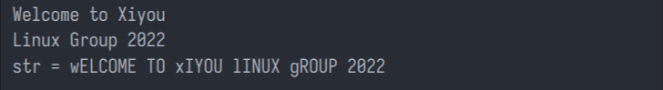
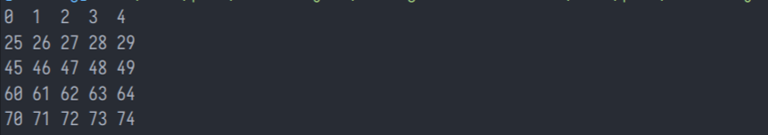

# 西邮Linux兴趣小组2022纳新面试题

>感谢 [Zhilu](https://github.com/L33Z22L11) 重新录入题目原件。好人一生平安。

>- 本题目只作为`Xiyou Linux兴趣小组`2022纳新面试的有限参考。
>- 为节省版面，本试题的程序源码省去了`#include`指令。
>- 本试题中的程序源码仅用于考察C语言基础，不应当作为C语言「代码风格」的范例。
>- 题目难度随机排列。
>- 所有题目编译并运行于`x86_64 GNU/Linux`环境。

> 学长寄语：
> 长期以来，西邮Linux兴趣小组的面试题以难度之高名扬西邮校内。我们作为出题人也清楚的知道这份试题略有难度。请别担心。**若有同学能完成一半的题目，就已经十分优秀。** 其次，相比于题目的答案，我们对你的思路和过程更感兴趣，或许你的答案略有瑕疵，但你正确的思路和对知识的理解足以为你赢得绝大多数的分数。最后，做题的过程也是学习和成长的过程，相信本试题对你更加熟悉的掌握C语言的一定有所帮助。祝你好运。我们FZ103见！

Copyright © 2022 西邮Linux兴趣小组, All Rights Reserved.
本试题使用采用 [知识共享署名-非商业性使用-相同方式共享 4.0 国际许可协议](http://creativecommons.org/licenses/by-nc-sa/4.0/) 进行许可。

## 0. 我的计算器坏了？！
> `2^10 = 1024`对应于十进制的4位，那么`2^10000`对应于十进制的多少位呢?

2^10000明显是一个非常大的数，这里可以转换一下思维，首先以科学计数法可知道数字可以用xEa,表示，其中a刚好是我们需要的结果，所以可以利用对数运算，求出a
```c
#include <stdio.h>
#include <math.h>
int main()
{
    printf("%.0f",10000*log10(2));
}
```

所以答案为3010
***

## 1. printf还能这么玩？

> 尝试着解释程序的输出。

```c
int main(void) {   if ((3 + 2 < 2) > (3 + 2 > 2))
        printf("Welcome to Xiyou Linux Group\n");
    else
        printf("%d\n", printf("Xiyou Linux Group - 2%d", printf("")));
}
```

`+`运算优先级高于`>`所以先进行加法运算，左式结果为0，右式为1，所以`if()`条件为假，执行else后面的语句。

这里主要考的是`printf()`的返回值，即`printf()`输出的字符的长度
所以最里面的prinf()返回0，第二个`printf()`的返回值为22，第三个`printf`的返回值为22
依次输出后结果为Xiyou Linux Group - 2022

***

## 2. 你好你好你好呀！

>- 程序的输出有点奇怪，请尝试解释一下程序的输出吧。
>- 请谈谈对`sizeof()`及`strlen()`的理解吧。

```c
int main(void) {
    char p0[] = "Hello,Linux";
    char *p1 = "Hello,Linux";
    char p2[11] = "Hello,Linux";
    printf("p0 == p1: %d, strcmp(p0, p2): %d\n", p0 == p1, strcmp(p0, p2));
    printf("sizeof(p0): %zu, sizeof(p1): %zu, sizeof(*p2): %zu\n",
           sizeof(p0), sizeof(p1), sizeof(*p2));
    printf("strlen(p0): %zu, strlen(p1): %zu\n", strlen(p0), strlen(p1));
}
```
输出结果为


`sizeof()`计算的是变量所占的内存大小，`strlen()`计算的是字符串本身长度（遇到`'\0'`结束）

第一行：`p0 == p1`比较的是他们的地址，所以返回值为0；`strcmp(p0,p2)`是一个比较字符串的函数，前者大返回一个正数，两者一样返回0，后者大返回一个负数，`p2`只能容纳11个字符，所`p0`小于`p2`，返回负数；

第二行：`p0`实际占用12个字节； `p1`是一个指针，指针所占内存大小为8； `&p2`表示`p2`的首元素，所以大小为1

第三行：`p0`实际长度为11，`p1`实际长度也为11，所以输出为11 11

***

## 3. 换个变量名不行吗？

>请结合本题，分别谈谈你对C语言中「全局变量」和「局部变量」的「生命周期」理解。

```c
int a = 3;//a为全局变量
void test() {
    int a = 1;//a为局部变量，只在test()函数中生效
    a += 1;
    {
        int a = a + 1;//a为局部变量，只在该花括号内生效；在生命的同时由用了a，所以会给a赋1个随机值
        printf("a = %d\n", a);
    }
    printf("a = %d\n", a);
}
int main(void) {
    test();
    printf("a= %d\n", a);
}
```
「全局变量」「局部变量」的「生命周期」见21年面试题
***

## 4. 内存对不齐

>`union`与`struct`各有什么特点呢，你了解他们的内存分配模式吗。

```c
typedef union {
    long l;
    int i[5];
    char c;
} UNION;
typedef struct {
    int like;
    UNION coin;
    double collect;
} STRUCT;
int main(void) {
    printf("sizeof (UNION) = %zu\n", sizeof(UNION)); 
    printf("sizeof (STRUCT) = %zu\n", sizeof(STRUCT));
}
```
见21年第2题
补充：共用体：共用同一块内存，计算的时候以其中最长的元素为准。
   相关知识点： >https://blog.csdn.net/m0_57180439/article/details/120417270?ops_request_misc=&request_id=&biz_id=102&utm_term=%E8%81%94%E5%90%88%E4%BD%93%E7%9B%B8%E5%85%B3%E7%9F%A5%E8%AF%86%E7%82%B9&utm_medium=distribute.pc_search_result.none-task-blog-2~all~sobaiduweb~default-1-120417270.142^v65^control,201^v3^control_1,213^v2^t3_esquery_v1&spm=1018.2226.3001.4187

***

## 5. Bitwise

>- 请使用纸笔推导出程序的输出结果。
>- 请谈谈你对位运算的理解。

```c
int main(void) {
    unsigned char a = 4 | 7;
    a <<= 3;
    unsigned char b = 5 & 7;
    b >>= 3;
    unsigned char c = 6 ^ 7;
    c = ~c;
    unsigned short d = (a ^ c) << 3;
    signed char e = -63;
    e <<= 2;
    printf("a: %d, b: %d, c: %d, d: %d\n", a, b, c, (char)d);
    printf("e: %#x\n", e);
}
```
位运算，见21年第6题
输出为：
```c
a: 56, b: 0, c: 254, d: 48
e: 0x4
```

***

## 6. 英译汉

>请说说下面数据类型的含义，谈谈`const`的作用。
>1. `char *const p`。
>2. `char const *p`。
>3. `const char *p`。

1 中p指针是只读的，即不可修改，只能指向固定的内存
2和3中指针指向的数据是只读的，即所指向的数字不可被修改
>const只与*的位置有关

***

## 7. 汉译英

>请用变量`p`给出下面的定义:
>1. 含有10个指向`int`的指针的数组。
>2. 指向含有10个`int`数组的指针。
>3. 含有3个「指向函数的指针」的数组，被指向的函数有1个`int`参数并返回`int`。

```c
int *p[10];
int (*p)[10];
int (*pf[])(int);
```
***

## 8. 混乱中建立秩序

>你对排序算法了解多少呢?  
>请谈谈你所了解的排序算法的思想、稳定性、时间复杂度、空间复杂度。
>提示：动动你的小手敲出来更好哦~

冒泡排序、插入排序、选择排序、快速排序、归并排序等
```c
//冒泡排序
void bub_sort(int* p,int n)//p为需要排序的数组，n为需要排序的数组的长度
{
    for(int i=0;i<n;i++)
    {
        for(int j=0;j<n;j++)
        {
            if(p[j]>p[j+1])//从小到大排
            {
                int t=p[j];
                p[j]=p[j+1];
                p[j+1]=t;
            }
        }
    }
}
```
快速排序：「分治」确定一个中间值x，分别从两头开始扫，左边遇到比x大的元素停止，右边遇到小于x的元素停止，将左右两个元素调换，然后继续进行扫表，直至两边相遇。
重复上述操作即可得到从小到大排列的数列。

    十大经典排序算法->https://zhuanlan.zhihu.com/p/42586566

***

## 9. 手脑并用

>请实现ConvertAndMerge函数：  
>拼接输入的两个字符串，并翻转拼接后得到的新字符串中所有字母的大小写。

>提示:你需要为新字符串分配空间。

```c
char* convertAndMerge(/*补全签名*/);
int main(void) {
    char words[2][20] = {"Welcome to Xiyou ", "Linux Group 2022"};
    printf("%s\n", words[0]);
    printf("%s\n", words[1]);
    char *str = convertAndMerge(words);
    printf("str = %s\n", str);
    free(str);
}
```

```c
char* convertAndMerge(char words[][20]) {
    // 计算链接后字符串的长度
    int len = 0;
    for (int i = 0;i<2; i++) {
        len += strlen(words[i]);
    }
    // 申请一个新的字符串来接收拼接后的字符串
    char *str = (char*)malloc(len + 1);
    if (str == NULL) {
        return NULL;
    }
    
    int pos = 0;
    for (int i = 0; i <2; i++) {
        strcpy(str + pos, words[i]);
        pos += strlen(words[i]);
    }
    //大小写转换
   for(int i=0;i<strlen(str);i++){
    if(str[i]<='z'&&str[i]>='a') str[i]-=32;
    else if(str[i]<='Z'&&str[i]>='A') str[i]+=32;
   }
   str[strlen(str)]='\0';

    return str;
}
```


***

## 10. 给你我的指针，访问我的心声

程序的输出有点奇怪，请尝试解释一下程序的输出吧。

```c
int main(int argc, char **argv) {
    int arr[5][5];
    int a = 0;
    for (int i = 0; i < 5; i++) {
        int *temp = *(arr + i);
        for (; temp < arr[5]; temp++) *temp = a++;
    }
    for (int i = 0; i < 5; i++) {
        for (int j = 0; j < 5; j++) {
            printf("%d\t", arr[i][j]);
        }
        printf("\n")
    }
}
```
每次循环后a中元素的值
```c
    //1
    0  1  2  3  4 
    5  6  7  8  9
    10 11 12 13 14 
    15 16 17 18 19
    20 21 22 23 24
    //2
    0  1  2  3  4
    25 26 27 28 29
    30 31 32 33 34
    35 36 37 38 39
    40 41 42 43 44
    //3
    0  1  2  3  4 
    25 26 27 28 29
    45 46 47 48 49
    50 51 52 53 54
    55 56 57 58 59 
    //4
    0  1  2  3  4 
    25 26 27 28 29
    45 46 47 48 49
    60 61 62 63 64
    65 66 67 68 69
    //5
    0  1  2  3  4 
    25 26 27 28 29
    45 46 47 48 49
    60 61 62 63 64
    70 71 72 73 74
```

***

## 11. 奇怪的参数

你了解argc和argv吗？  
直接运行程序argc的值为什么是1？  
程序会出现死循环吗？

```c
#include <stdio.h>
int main(int argc, char **argv) {
    printf("argc = %d\n", argc);
    while (1) {
        argc++;
        if (argc < 0) {
            printf("%s\n", (char *)argv[0]);
            break;
        }
    }
}
```
见21年第11题
不会陷入死循环，`char`类型只能存0-255，当`argc`自增到255时，再增加就会返回0；进入`if`，打印`argv[0]`，跳出循环。

***

## 12. 奇怪的字符

程序的输出有点奇怪，请尝试解释一下程序的输出吧。

```c
int main(int argc, char **argv) {
    int data1[2][3] = {{0x636c6557, 0x20656d6f, 0x58206f74},
                       {0x756f7969, 0x6e694c20, 0x00000000}};
    int data2[] = {0x47207875, 0x70756f72, 0x32303220, 0x00000a32};
    char *a = (char *)data1;
    char *b = (char *)data2;
    char buf[1024];
    strcpy(buf, a);
    strcat(buf, b);
    printf("%s \n", buf);
}
```
字符串拼接，强制类型转换，见2021年第13题

***

## 13. 小试宏刀

- 请谈谈你对`#define`的理解。
- 请尝试着解释程序的输出。

```c
#define SWAP(a, b, t) t = a; a = b; b = t
#define SQUARE(a) a *a
#define SWAPWHEN(a, b, t, cond) if (cond) SWAP(a, b, t)
int main() {
    int tmp;
    int x = 1;
    int y = 2;
    int z = 3;
    int w = 3;
    SWAP(x, y, tmp);//调换x y的值
    printf("x = %d, y = %d, tmp = %d\n", x, y, tmp);
    if (x>y) SWAP(x, y, tmp);//x>y成立，再次调换x y
    printf("x = %d, y = %d, tmp = %d\n", x, y, tmp);
    SWAPWHEN(x, y, tmp, SQUARE(1 + 2 + z++ + ++w) == 100);//SQUARE()=20,返回0；不调换
    printf("x = %d, y = %d\n", x, y, tmp);
    printf("z = %d, w = %d, tmp = %d\n", z, w, tmp);//z w都分别自增了两次
}
```
只做简单的替换，具体见2021年14.1。

***

## 14. GNU/Linux命令 (选做)

你知道以下命令的含义和用法吗：

注：
嘿！你或许对Linux命令不是很熟悉，甚至你没听说过Linux。  
但别担心，这是选做题，不会对你的面试产生很大的影响！  
了解Linux是加分项，但不了解也不扣分哦！
- `ls`//list 目录（某个路径下的所有文件（夹））
- `rm`//remove 移除
- `whoami`//who am I  显示与当前的有效用户 ID 相关联的用户名 与`id -un`用法一样

请问你还了解哪些GNU/Linux的命令呢。

`cd`//寻路径
等

> 恭喜你做到这里！你的坚持战胜了绝大多数看到这份试题的同学。  
> 或许你自己对答题的表现不满意,但别担心，请自信一点呐。  
> 坚持到达这里已经证明了你的优秀。  
> 还在等什么,快带上你的笔记本电脑，来FZ103面试吧!
